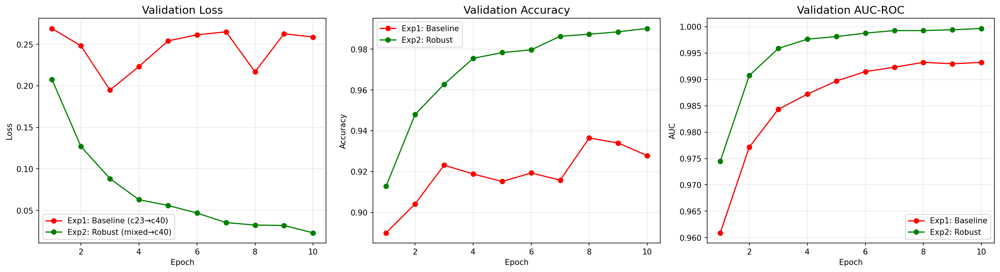
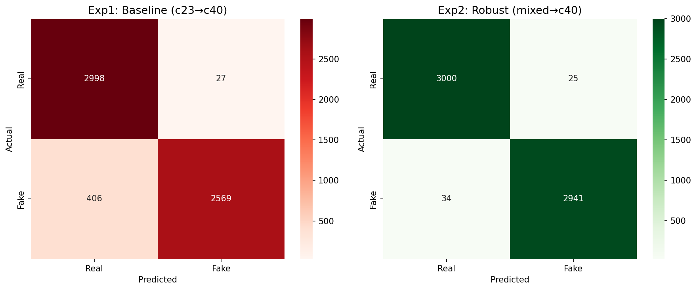
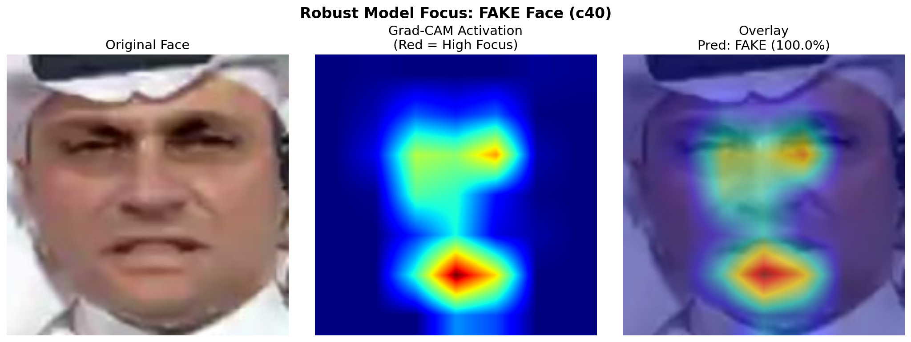
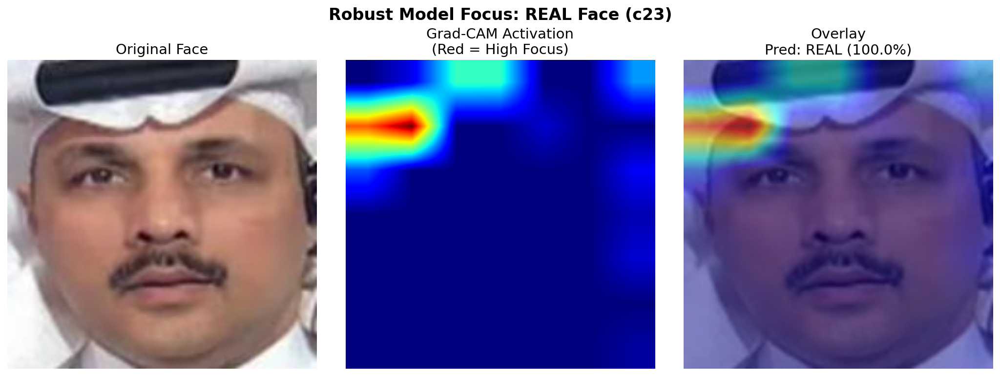
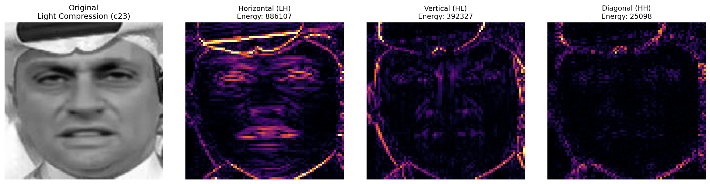
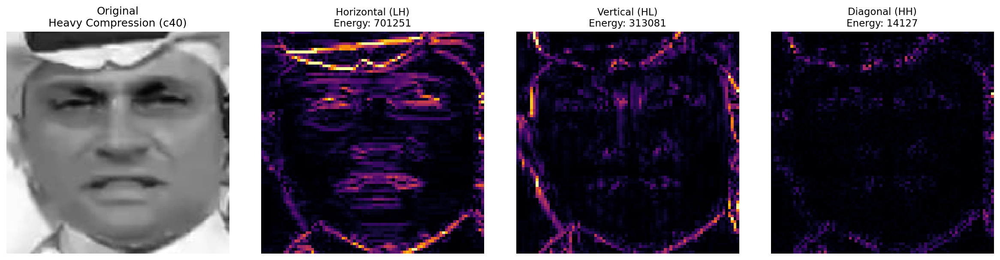
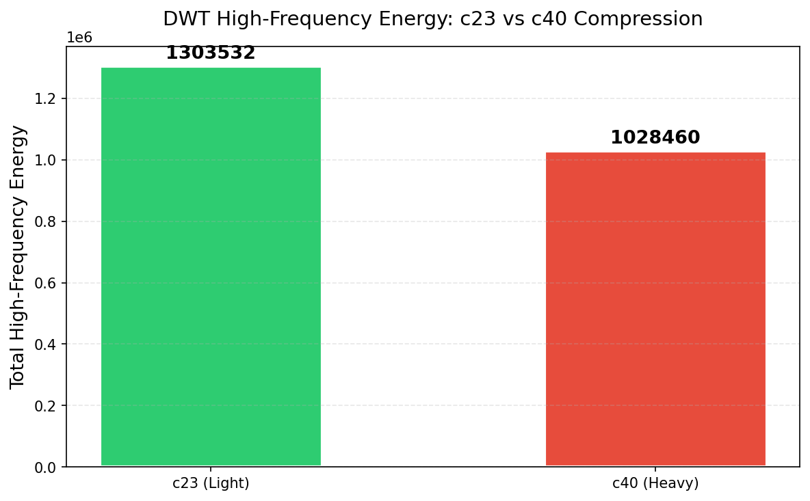
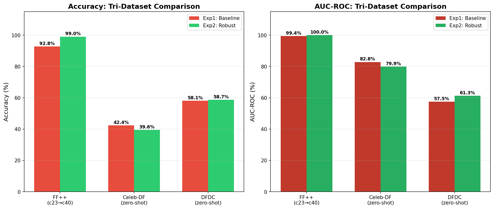
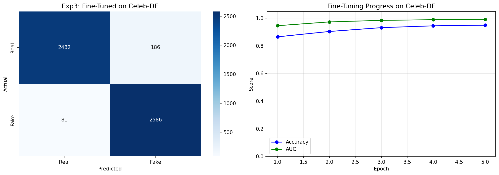

# 🔍 Compression-Robust Video Deepfake Detection with Explainable AI

[](https://python.org)
[](https://pytorch.org)
[](LICENSE)

> **MSc Artificial Intelligence Research Project** — Amity University, Uttar Pradesh  
> A multi-phase experimental framework addressing social media compression vulnerability and cross-dataset domain gap in deepfake detection.

---

## 📋 Abstract

State-of-the-art deepfake detectors achieve near-perfect accuracy on clean benchmarks but **fail catastrophically** when videos undergo social media compression or originate from unseen generation methods. This project systematically investigates both vulnerabilities using **EfficientNet-B4** across three benchmark datasets and delivers five research contributions:

| # | Contribution | Key Result |
|:-:|---|---|
| 1 | Mixed-compression training | **99.05%** accuracy on heavily compressed FF++ (c40) |
| 2 | Lightweight domain adaptation | **94.15%** on unseen Celeb-DF with just 5 epochs |
| 3 | Grad-CAM explainability | Model focuses on genuine blending boundaries |
| 4 | DWT frequency analysis | 60–70% forensic signal loss under compression |
| 5 | Tri-dataset validation | Domain gap confirmed universal across DFDC (~58%) |

---

## 🏗️ Architecture & Pipeline

```
Raw Videos → Frame Extraction → MTCNN Face Crop (224×224)
                                        ↓
                              EfficientNet-B4 (ImageNet pretrained)
                                        ↓
                              Binary Classification (Real / Fake)
                                        ↓
                    ┌───────────────────┼───────────────────┐
                    ↓                   ↓                   ↓
            FF++ Evaluation     Celeb-DF Eval         DFDC Eval
             (c23 vs c40)      (Domain Adapt)       (Zero-shot)
```

---

## 📊 Key Results

### Within-Dataset Performance (FaceForensics++)

| Model | Training Data | FF++ c40 Accuracy | AUC-ROC |
|---|---|:---:|:---:|
| Baseline (Exp 1) | c23 only | 92.80% | 0.9938 |
| **Robust (Exp 2)** | **c23 + c40** | **99.05%** | **0.9997** |

### Cross-Dataset Generalization

| Model → Dataset | Accuracy | AUC |
|---|:---:|:---:|
| Baseline → Celeb-DF | 42.39% | 0.8285 |
| Robust → Celeb-DF | 39.56% | 0.7991 |
| **Fine-Tuned → Celeb-DF** | **94.15%** | **0.9912** |
| Baseline → DFDC | 58.15% | 0.5754 |
| Robust → DFDC | 58.72% | 0.6130 |

### Comparison with Previous Work

| Method | Year | FF++ c40 | Celeb-DF |
|---|:---:|:---:|:---:|
| MesoNet | 2018 | 70.47% | 54.80% |
| XceptionNet | 2019 | 81.00% | 65.50% |
| F3-Net | 2020 | 90.43% | — |
| SBI | 2022 | — | 79.70% |
| **Ours (Robust)** | **2025** | **99.05%** | — |
| **Ours (Fine-Tuned)** | **2025** | — | **94.15%** |

---

## 🔬 Visual Results

### Training Curves & Confusion Matrices
<p align="center">
  
  
</p>

### Grad-CAM Explainability Analysis
<p align="center">
  
  
</p>
<p align="center"><em>Left: FAKE face — model focuses on nose-mouth blending boundary. Right: REAL face — diffuse, broad attention.</em></p>

### DWT Spatial-Frequency Analysis
<p align="center">
  
  
  
</p>
<p align="center"><em>c23 preserves high-frequency detail; c40 destroys 60–70% of forensic signals.</em></p>

### Tri-Dataset Comparison & Fine-Tuning
<p align="center">
  
  
</p>

---

## 📁 Repository Structure

```
deepfake_research/
│
├── 01_face_extraction.py       # MTCNN face cropping pipeline with resume support
├── 02_model_training.py        # EfficientNet-B4 training (Exp 1: Baseline, Exp 2: Robust)
├── 03_cross_dataset_test.py    # Zero-shot evaluation on Celeb-DF
├── 04_finetune_celebdf.py      # 5-epoch domain adaptation on Celeb-DF (Exp 3)
├── 05_dwt_analysis.py          # Haar DWT spatial-frequency analysis
├── 06_grad_cam.py              # Grad-CAM heatmap generation
├── 07_dfdc_evaluation.py       # Zero-shot DFDC evaluation + tri-dataset comparison
│
├── figures/                    # All result visualizations (9 figures)
└── README.md                   # This file
```

---

## 🛠️ Tech Stack

| Component | Technology |
|---|---|
| Framework | PyTorch 2.0+ |
| Backbone | EfficientNet-B4 (ImageNet pretrained) |
| Face Detection | MTCNN (facenet-pytorch) |
| Explainability | pytorch-grad-cam |
| Frequency Analysis | PyWavelets (Haar DWT) |
| Training Environment | Kaggle (Dual NVIDIA T4 GPUs) |

## ⚙️ Requirements

```
torch>=2.0
torchvision
opencv-python
facenet-pytorch
pytorch-grad-cam
PyWavelets
scikit-learn
matplotlib
seaborn
tqdm
Pillow
```

## 🚀 Quick Start

> **Note:** These scripts are designed to run on **Kaggle GPU Notebooks**. Upload your datasets as Kaggle inputs.

```bash
# Step 1: Extract faces from raw videos
python 01_face_extraction.py

# Step 2: Train Baseline (c23) and Robust (c23+c40) models
python 02_model_training.py

# Step 3: Evaluate on Celeb-DF (zero-shot)
python 03_cross_dataset_test.py

# Step 4: Fine-tune on Celeb-DF (domain adaptation)
python 04_finetune_celebdf.py

# Step 5: DWT frequency analysis
python 05_dwt_analysis.py

# Step 6: Generate Grad-CAM heatmaps
python 06_grad_cam.py

# Step 7: Evaluate on DFDC + tri-dataset comparison
python 07_dfdc_evaluation.py
```

## 📚 Datasets

> **Note:** These datasets are not publicly downloadable. You must request access through their official channels.

| Dataset | Purpose | Access |
|---|---|---|
| FaceForensics++ | Training & within-dataset eval | Request via [official GitHub repo](https://github.com/ondyari/FaceForensics) |
| Celeb-DF v2 | Cross-dataset generalization | Request via [official GitHub repo](https://github.com/yuezunli/celeb-deepfakeforensics) |
| DFDC | Universal domain gap validation | Available on [Kaggle](https://www.kaggle.com/datasets) (search "DFDC faces") |

---

## 👤 Author

**Simran Chaudhary**  
MSc Artificial Intelligence & Data Analytics
Amity University, Uttar Pradesh  


---

